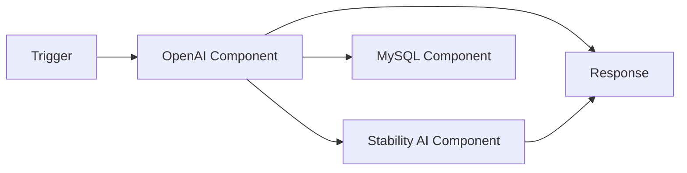
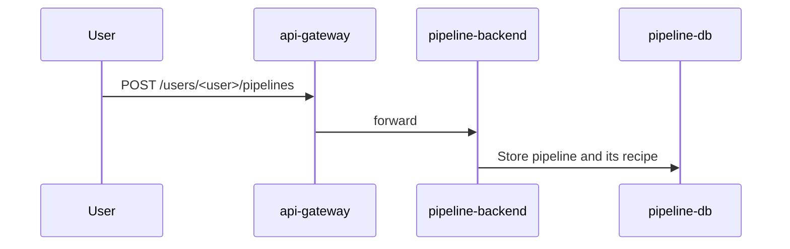
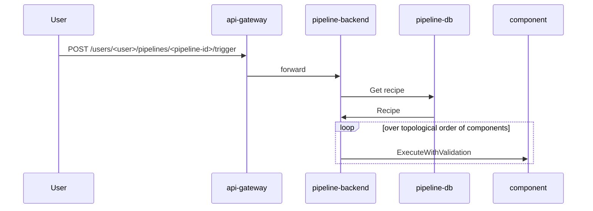

# pipeline-backend

[](https://github.com/instill-ai/pipeline-backend/actions/workflows/integration-test.yml)

`pipeline-backend` manages all pipeline resources within [Instill Core](https://github.com/instill-ai/instill-core) to streamline data from the
start component, through AI/Data/Application components and to the end
component.

## Concepts

### Pipeline

In **Instill Core**, a pipeline is a DAG (Directed Acyclic Graph) consisting
of multiple **components**.



### Component

A **Component** serves as an essential building block within a **Pipeline**.

See [the `component` package documentation](./pkg/component/README.md) for more
details.

### Recipe

A **pipeline recipe** specifies how components are configured and how they are
interconnected.

Recipes are defined in YAML language:

```yaml
variable:
  # pipeline input fields
output:
  # pipeline output fields
component:
  <component-id>:
    type: <component-definition-id>
    task: <task-id>
    input:
      # values for the input fields
    condition: <condition> # conditional statement to execute or bypass the component
    setup: <setup> # setup specification values required in AI, Data and Application components
```

The [component development
guide](./pkg/component/CONTRIBUTING.md#example-recipe) contains a full example
recipe.



### Trigger

When a pipeline is triggered, the DAG will be computed in order to execute
components in topological order.



## Contributing

We welcome contributions from the community! Whether you're a developer,
designer, writer, or user, there are multiple ways to contribute:

### Issue Guidelines

We foster a friendly and inclusive environment for issue reporting. Before
creating an issue, check if it already exists. Use clear language and provide
reproducible steps for bugs. Accurately tag the issue (bug, improvement,
question, etc.).

### Code Contributions

Please refer to the [Contributing Guidelines](./.github/CONTRIBUTING.md) for
more details. Your code-driven innovations are more than welcome!

## Community

We are committed to providing a respectful and welcoming atmosphere for all
contributors. Please review our [Code of
Conduct](https://github.com/instill-ai/.github/blob/main/.github/CODE_OF_CONDUCT.md)
to understand our standards.

### Efficient Triage Process

We have implemented a streamlined [Issues Triage Process](.github/triage.md)
aimed at swiftly categorizing new issues and pull requests (PRs), allowing us to
take prompt and appropriate actions.

### Engage in Dynamic Discussions and Seek Support

Head over to our [Discussions](https://github.com/orgs/instill-ai/discussions)
for engaging conversations:

- [General](https://github.com/orgs/instill-ai/discussions/categories/general):
  Chat about anything related to our projects.
- [Polls](https://github.com/orgs/instill-ai/discussions/categories/polls):
  Participate in community polls.
- [Q&A](https://github.com/orgs/instill-ai/discussions/categories/q-a): Seek
  help or ask questions; our community members and maintainers are here to
  assist.
- [Show and
  Tell](https://github.com/orgs/instill-ai/discussions/categories/show-and-tell):
  Showcase projects you've created using our tools.

Alternatively, you can also join our vibrant
[Discord](https://discord.gg/sevxWsqpGh) community and direct your queries to
the #ask-for-help channel. We're dedicated to supporting you every step of the
way.

## License

See the [LICENSE](./LICENSE) file for licensing information.
