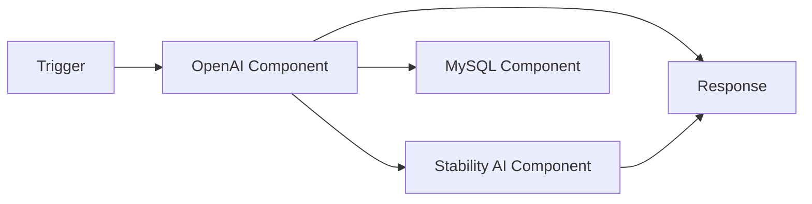
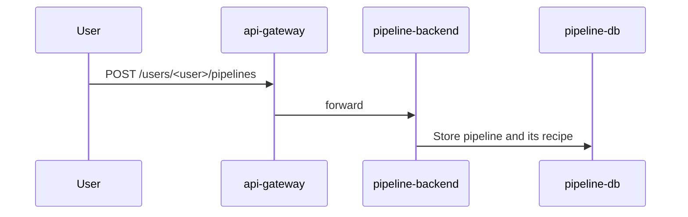
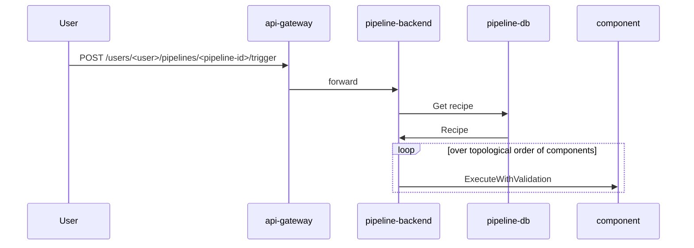

# Contributing Guidelines

## Concepts

Before delving into the details to come up with your first PR, please
familiarize yourself with the project structure of 🔮 [**Instill
Core**](https://github.com/instill-ai/community#instill-core).

### Pipeline

In **💧 Instill VDP**, a pipeline is a DAG (Directed Acyclic Graph) consisting of multiple
**components**.



### Component

A **Component** serves as an essential building block within a **Pipeline**.

See [README](./README.md) for more details.

### Recipe

A **pipeline recipe** specifies how components are configured and how they are
interconnected.

Recipes are defined in YAML language:

```yaml
variable:
  # pipeline input fields
output:
  # pipeline output fields
component:
  <component-id>:
    type: <component-definition-id>
    task: <task-id>
    input:
      # values for the input fields
    condition: <condition> # conditional statement to execute or bypass the component
    setup: <setup> # setup specification values required in AI, Data and Application components
```

You can see an example recipe in the [component development
guide](#example-recipe)



### Trigger

When a pipeline is triggered, the DAG will be computed in order to execute
components in topological order.



## Development

This section will guide you through the steps to contribute with a new
component. You'll add and test an operator that takes a string `target` as input
and returns a `"Hello, ${target}!"` string as the component output

In order to add a new component, you need to:
- Define the component configuration. This will determine the tasks that can be
  performed by the component and their input and output parameters. The
  console frontend will use the configuration files to render the component
  in the pipeline editor page.
- Implement the component interfaces so `pipeline-backend` can execute the
  component without knowing its implementation details.
- Initialize the component, i.e., include the implementation of the component
  interfaces as a dependency in the `pipeline-backend` execution.

### Environment setup

Although all the development will be done in this repository, if you want to
[see your component in action](#use-the-component-in-vdp), you'll need to build
VDP locally. First, launch the latest version of 🔮 [**Instill
Core**](https://github.com/instill-ai/instill-core) suite. Then, build and
launch 💧 [**Instill VDP**](https://github.com/instill-ai/pipeline-backend)
backend with your local changes.

If you want to know more, you can refer to the documentation in these
repositories, which explains in detail how to set up the development
environment. In short, here's what we'll need to do for this guide:

#### Building 🔮 Instill Core suite

```sh
$ git clone https://github.com/instill-ai/instill-core && cd instill-core
$ make latest PROFILE=exclude-pipeline
```

#### Building 💧 Instill VDP backend

```sh
$ git clone https://github.com/instill-ai/pipeline-backend && cd pipeline-backend
$ make build && make dev
$ docker exec -d pipeline-backend go run ./cmd/worker # run without -d in a separate terminal if you want to access the logs
$ docker exec pipeline-backend go run ./cmd/main
```

### Create the component package

```sh
$ # From <workspace>/pipeline-backend:
$ cd ./pkg/component
$ mkdir -p operator/hello/v0 && cd $_
```

Components are isolated in their own packages under their component type (`ai`,
`data`, `application`, etc.).  The package is versioned so, in case a breaking
change needs to be introduced (e.g. supporting a new major version in a vendor
API), existing pipelines using the previous version of the component can keep
being triggered.

At the end of this guide, this will be the structure of the package:

```
operator/hello/v0
 ├──.compogen
 │  └──extra-bottom.mdx
 ├──assets
 │  └──hello.svg
 ├──config
 │  ├──definition.json
 │  └──tasks.json
 ├──main.go
 ├──operator_test.go
 └──README.mdx
 ```

### Add the configuration files

Create a `config` directory and add the files `definition.json`, `tasks.json`,
and `setup.json` (optional). Together, these files define the behavior of the
component.

#### `definition.json`

The `definition.json` file describes the high-level information of the
component.

```json
{
  "id": "hello",
  "uid": "e05d3d71-779c-45f8-904d-e90a050ca3b2",
  "title": "Hello",
  "description": "'Hello, world' operator used as a template for adding components",
  "spec": {},
  "availableTasks": [
    "TASK_GREET"
  ],
  "documentationUrl": "https://www.instill.tech/docs/component/operator/hello",
  "icon": "assets/hello.svg",
  "version": "0.1.0",
  "sourceUrl": "https://github.com/instill-ai/component/blob/main/operator/hello/v0",
  "releaseStage": "RELEASE_STAGE_ALPHA",
  "public": true
}
```

This file defines the component properties:

- **`id`** is the ID of the component. It must be unique.
- **`uid`** is a UUID string that must not be already taken by another
  component. Once it is set, it must not change.
- **`title`**: is the display title of the component.
- **`description`**: is a short sentence describing the purpose of the
  component. It should be written in imperative tense.
- **`spec`** contains the parameters required to configure the component and
  that are independent from its tasks. E.g., the API token of a vendor. In
  general, only AI, data or application components need such parameters.
- **`availableTasks`** defines the tasks the component can perform.
  - When a component is created in a pipeline, one of the tasks has to be
    selected, i.e., a configured component can only execute one task.
  - Task configurations are defined in `tasks.json`.
- **`documentationUrl`** points to the official documentation of the component.
- **`icon`** is the local path to the icon that will be displayed in the console
  when creating the component. If left blank, a placeholder icon will be shown.
- **`version`** must be a [SemVer](https://semver.org/) string. It is encouraged
  to keep a [tidy version history](#sane-version-control).
- **`sourceUrl`** points to the codebase that implements the component. This
  will be used by the documentation generation tool and also will be part of the
  [component definition
  list](https://openapi.instill.tech/reference/pipelinepublicservice_listcomponentdefinitions)
  endpoint.
- **`releaseStage`** describes the release stage of the component. Unimplemented
  stages (`RELEASE_STAGE_COMING_SOON` or `RELEASE_STAGE_OPEN_FOR_CONTRIBUTION`)
  will hide the component from the console (i.e. they can't be used in
  pipelines) but they will appear in the component definition list endpoint.
- **`public`** indicates whether the component is visible to the public.


#### `tasks.json`

The `tasks.json` file describes the task details of the component. The key
should be in the format `TASK_NAME`.

```json
{
  "TASK_GREET": {
    "instillShortDescription": "Greet someone / something",
    "title": "Greet",
    "input": {
      "description": "Input",
      "instillUIOrder": 0,
      "properties": {
        "target": {
          "instillUIOrder": 0,
          "description": "The target of the greeting",
          "instillAcceptFormats": [
            "string"
          ],
          "instillUpstreamTypes": [
            "value",
            "reference",
            "template"
          ],
          "instillUIMultiline": true,
          "title": "Greeting target",
          "type": "string"
        }
      },
      "required": [
        "target"
      ],
      "title": "Input",
      "type": "object"
    },
    "output": {
      "description": "The greeting sentence",
      "instillUIOrder": 0,
      "properties": {
        "greeting": {
          "description": "A greeting sentence addressed to the target",
          "instillUIOrder": 0,
          "required": [],
          "title": "Greeting",
          "type": "string",
          "instillFormat": "string"
        }
      },
      "required": [
        "greeting"
      ],
      "title": "Output",
      "type": "object"
    }
  }
}
```

This file defines the input and output schema of each task:

**Properties within a Task**

- **`title`** is used by the console to provide the title of the task in the
  component.
- **`description`** and **`instillShortDescription`** are used by the console to
  provide a description of the task in the component. If
  **`instillShortDescription`** does not exist, it will be the same as
  **`description`**.
- **`input`** is a JSON Schema that describes the input of the task.
- **`output`** is a JSON Schema that describes the output of the task.

**Properties within `input` and `output` Objects**

- **`required`** indicates whether the property is required.
- **`type`**: describes the JSON type of this field, which could be `integer`,
  `number`, `boolean`, `string`, `array`, or `object`.
- **`title`** is used by the console to provide the title of the property in the component.
- **`description`** is used by the console to provide information about this
  task in the component.
- **`instillShortDescription`**: is a concise version of `description`, used to
  fit smaller spaces such as a component form field. If this value is empty, the
  `description` value will be used.
- **`instillUIOrder`** defines the order in which the properties will be
  rendered in the component.
- **`instillUIMultiline`** indicates whether the text field in the component is
  multiline.

**Properties within `input` Objects**

- **`instillEditOnNodeFields`** determines whether this field will appear at the
  forefront of the component. Optional properties can be set in the
  advanced configuration.
- **`instillAcceptFormats`** is an array indicating the data types of acceptable
  input fields. It should be an array of [**Instill
  Format**](https://www.instill.tech/docs/vdp/instill-format).
- **`instillUpstreamTypes`** defines how an input property can be set: as a
  direct value, a reference to another value in the pipeline, or a combination
  of both (e.g., `${variable.name}` or `my dear ${variable.name}`).
- **`instillSecret`** indicates the data must reference the secrets and cannot
  be used in plaintext.

**Properties within `output` Objects**

- **`instillFormat`** indicates the data type of the output field, which should
  be one of `number`, `integer`, `string`, `object`, `boolean`, or MIME type.
  Please refer to [**Instill
  Format**](https://www.instill.tech/docs/vdp/instill-format) for more details.

See the [example recipe](#example-recipe) to understand how these fields map to
the recipe of a pipeline when configured to use this operator.

#### `setup.json`

For components that need to set up some configuration before execution, such as
the `api-key` required by the component, `setup.json` can be used to describe
these configurations. The format is the same as the `input` objects in
`tasks.json`.

### Implement the component interfaces

Pipeline communicates with components through the `IComponent` interface,
defined in the [`base`](../base) package. This package also defines base
implementations for these interfaces, so the `hello` component will only need to
override the following methods:
- `CreateExecution(ComponentExecution)
  (IExecution, error)` will return an implementation of the `IExecution`
  interface. A base execution implementation is passed in order to define only
  the behaviour of the `Execute` method.
- `Execute(context.Context []*structpb.Struct) ([]*structpb.Struct, error)` is
  the most important function in the component. All the data manipulation will
  take place here.

Paste the following code into a `main.go` file in `operator/hello/v0`:

```go
package hello

import (
    "fmt"
    "sync"

    _ "embed"

    "go.uber.org/zap"
    "google.golang.org/protobuf/types/known/structpb"

    "github.com/instill-ai/component/base"
)

const (
	taskGreet = "TASK_GREET"
)

var (
	//go:embed config/definition.json
	definitionJSON []byte
	//go:embed config/tasks.json
	tasksJSON []byte

	once   sync.Once
	comp   *component
)

type component struct {
	base.Component
}

type execution struct {
	base.ComponentExecution
}

// Init returns an implementation of IComponent that implements the greeting
// task.
func Init(bc base.Component) *component {
	once.Do(func() {
		comp = &component{Component: bc}
		err := comp.LoadDefinition(definitionJSON, nil, tasksJSON, nil)
		if err != nil {
			panic(err)
		}
	})
	return comp
}

func (c *component) CreateExecution(x base.ComponentExecution) (base.IExecution, error) {
	e := &execution{ ComponentExecution: x }

	if x.Task != taskGreet {
		return nil, fmt.Errorf("unsupported task")
	}

	return e, nil
}

func (e *execution) Execute(ctx context.Context, jobs []*base.Job) error {
	return nil
}
```

### Add the execution logic

The `hello` operator created in the previous section doesn't implement any
logic. This section will add the greeting logic to the `Execute` method.

Let's modify the following methods:

```go
type execution struct {
	base.ComponentExecution
	execute func(*structpb.Struct) (*structpb.Struct, error)
}

func (c *component) CreateExecution(x base.ComponentExecution) (base.IExecution, error) {
	e := &execution{ ComponentExecution: x }

	// A simple if statement would be enough in a component with a single task.
	// If the number of task grows, here is where the execution task would be
	// selected.
	switch x.Task {
	case taskGreet:
		e.execute = e.greet
	default:
		return nil, fmt.Errorf("unsupported task")
	}

	return e, nil
}
func (e *execution) Execute(ctx context.Context, jobs []*base.Job) error {

	// An execution  might take several inputs. One result will be returned for
	// each one of them, containing the execution output for that set of
	// parameters.
	for i, job := range jobs {
    input, err := job.Input.Read(ctx)
    if err != nil {
      return err
    }
		output, err := e.execute(input)
		if err != nil {
			return err
		}

		err = job.Output.Write(ctx, output)
    if err != nil {
			return err
		}
	}

	return nil
}

func (e *execution) greet(in *structpb.Struct) (*structpb.Struct, error) {
	out := new(structpb.Struct)

	target := in.Fields["target"].GetStringValue()
	greeting := "Hello, " + target + "!"

	out.Fields = map[string]*structpb.Value{
		"greeting": structpb.NewStringValue(greeting),
	}

	return out, nil
}
```

#### End-user error messages

The [`errmsg`](https://github.com/instill-ai/x/tree/main/errmsg) package allows
us to attach messages to our errors.

```go
func (e *execution) greet(in *structpb.Struct) (*structpb.Struct, error) {
	out := new(structpb.Struct)

	greetee := in.Fields["target"].GetStringValue()
	if greetee == "Voldemort" {
		return nil, errmsg.AddMessage(fmt.Errorf("invalid greetee"), "He-Who-Must-Not-Be-Named can't be greeted.")
	}

	greeting := "Hello, " + greetee + "!"

	out.Fields = map[string]*structpb.Value{
		"greeting": structpb.NewStringValue(greeting),
	}

	return out, nil
}
```

The middleware in `pipeline-backend` will capture error messages in order to
to return a human-friendly errors to the API clients and console users.

#### Unit tests

Before initializing testing your component in **💧 Instill VDP**, we can unit test its
behaviour. The following covers the newly added logic by replicating how the
`pipeline-backend` workers execute the component logic:

```go
package hello

import (
	"context"
	"testing"

	"go.uber.org/zap"
	"google.golang.org/protobuf/types/known/structpb"

	qt "github.com/frankban/quicktest"
	"github.com/instill-ai/component/base"
)

func TestOperator_Execute(t *testing.T) {
	c := qt.New(t)
	ctx := context.Background()

	bc := base.Component{Logger: zap.NewNop()}
	component := Init(bc)

	c.Run("ok - greet", func(c *qt.C) {
		exec, err := component.CreateExecution(base.ComponentExecution{
			Component: component,
			Task:      taskGreet,
		})
		c.Assert(err, qt.IsNil)

		pbIn, err := structpb.NewStruct(map[string]any{"target": "bolero-wombat"})
		c.Assert(err, qt.IsNil)

    ir, ow, eh, job := base.GenerateMockJob(c)
    ir.ReadMock.Return(&pbIn, nil)
    ow.WriteMock.Optional().Set(func(ctx context.Context, output *structpb.Struct) (err error) {
      // Check JSON in the output string.
      greeting := output.Fields["greeting"].GetStringValue()
      c.Check(greeting, qt.Equals, "Hello, bolero-wombat!")
      return nil
    })
    eh.ErrorMock.Optional()

    err = execution.Execute(ctx, []*base.Job{job})
    c.Assert(err, qt.IsNil)

	})
}

func TestOperator_CreateExecution(t *testing.T) {
	c := qt.New(t)

	bc := base.Component{Logger: zap.NewNop()}
	operator := Init(bc)

	c.Run("nok - unsupported task", func(c *qt.C) {
		task := "FOOBAR"

		_, err := operator.CreateExecution(base.ComponentExecution{
			Component: component,
			Task: task,
		})
		c.Check(err, qt.ErrorMatches, "unsupported task")
	})
}
```

### Initialize the component

The last step before being able to use the component in **💧 Instill VDP** is loading the
`hello` operator. This is done in the `Init` function in
[`component.go`](../component.go):

```go
package operator

import (
	// ...
	"github.com/instill-ai/component/operator/hello/v0"
)

// ...

func Init(logger *zap.Logger) *Store {
	baseComp := base.component{Logger: logger}

	once.Do(func() {
		store = &Store{
			componentUIDMap: map[uuid.UUID]*component{},
			componentIDMap:  map[string]*component{},
		}
		// ...
		store.Import(hello.Init(baseComp))
	})

	return store
}
```

### Use the component in 💧 Instill VDP

Re-run your local `pipeline-backend` build:

```sh
$ make stop && make dev
$ docker exec -d pipeline-backend go run ./cmd/worker # run without -d in a separate terminal if you want to access the logs
$ docker exec pipeline-backend go run ./cmd/main
```

Head to the console at http://localhost:3000/ (default password is `password`)
and create a pipeline.

- In the **trigger** component, add a `who` text field.
- Create a **hello** operator and reference the **trigger** input field by
  adding `${trigger.who}` to the `target` field.
- In the **response** component, add a `greeting` output value that references
  the **hello** output by introducing `${hello-0.output.greeting}`.

If you introduce a `Wombat` string value in the **trigger** component and
**Run** the pipeline, you should see `Hello, Wombat!` in the response.

#### Example recipe

The created pipeline will have the following recipe:

```json
variable:
  who:
  title: Who
  description: Who should be greeted?
  instill-format: string
output:
  greeting:
  title: Greeting
  description:
  value: ${hello-0.output.greeting}
component:
  hello-0:
  type: hello
  task: TASK_GREET
  input:
    target: ${variable.who}
  condition:
```

### Document the component

Documentation helps user to integrate the component in their pipelines. A good
component definition will have clear names for their fields, which will also
contain useful descriptions. The information described in `definition.json` and
`tasks.json` is enough to understand how a component should be used. `compogen`
is a tool that parses the component configuration and builds a `README.mdx` file
document displaying its information in a human-readable way. To generate the
document, just add the following line on top of `operator/hello/v0/main.go`:

```go
//go:generate compogen readme ./config ./README.mdx
```

Then, go to the base of the `component` repository and run:

```sh
$ make build-doc && make gen-doc
```

#### Adding extra sections

The documentation of the component can be extended with the `--extraContents`
flag:

```sh
$ mkdir -p operator/hello/.compogen
$ echo '### Final words

Thank you for reading!' > operator/hello/.compogen/extra-bottom.mdx
```

```go
//go:generate compogen readme ./config ./README.mdx --extraContents bottom=.compogen/extra-bottom.mdx
```

Check `compogen`'s [README](./tools/compogen/README.md) for more information.

## Sane version control

The version of a component is useful to track its evolution and to set
expectations about its stability. When the interface of a component (defined by
its configuration files) changes, its version should change following the
Semantic Versioning guidelines.

- Patch versions are intended for bug fixes.
- Minor versions are intended for backwards-compatible changes, e.g., a new task
  or a new input field with a default value.
- Major versions are intended for backwards-incompatible changes.
  - At this point, since there might be pipelines using the previous version, a
    new package MUST be created. E.g., `operator/json/v0` -> `operator/json/v1`.
- Build and pre-release labels are discouraged, as components are shipped as
  part of **💧 Instill VDP** and they aren't likely to need such fine-grained
  version control.

It is recommended to start a component at `v0.1.0`. A major version 0 is
intended for rapid development.

The `releaseStage` property in `definition.json` indicates the stability of a
component.

- A component skeleton (with only the minimal configuration files and a dummy
  implementation of the interfaces) may use the _Coming Soon_ or _Open For
  Contribution_ stages in order to communicate publicly about upcoming
  components. The major and minor versions in this case MUST be 0.
- Alpha pre-releases are used in initial implementations, intended to gather
  feedback and issues from early adopters.  Breaking changes are acceptable at
  this stage.
- Beta pre-releases are intended for stable components that don't expect
  breaking changes.
- General availability indicates production readiness. A broad adoption of the
  beta version in production indicates the transition to GA is ready.

The typical version and release stage evolution of a component might look like
this:

| Version | Release Stage         |
| :------ | :-------------------- |
| 0.1.0   | `RELEASE_STAGE_ALPHA` |
| 0.1.1   | `RELEASE_STAGE_ALPHA` |
| 0.1.2   | `RELEASE_STAGE_ALPHA` |
| 0.2.0   | `RELEASE_STAGE_ALPHA` |
| 0.2.1   | `RELEASE_STAGE_ALPHA` |
| 0.3.0   | `RELEASE_STAGE_BETA`  |
| 0.3.1   | `RELEASE_STAGE_BETA`  |
| 0.4.0   | `RELEASE_STAGE_BETA`  |
| 1.0.0   | `RELEASE_STAGE_GA`    |

## Sending PRs

Please take these general guidelines into consideration when you are sending a
PR:

1. **Fork the Repository:** Begin by forking the repository to your GitHub
   account.
2. **Create a New Branch:** Create a new branch to house your work. Use a clear
   and descriptive name, like `<your-github-username>/<what-your-pr-about>`.
3. **Make and Commit Changes:** Implement your changes and commit them. We
   encourage you to follow these best practices for commits to ensure an
   efficient review process:
   - Adhere to the [conventional commits
     guidelines](https://www.conventionalcommits.org/) for meaningful commit
     messages.
   - Follow the [7 rules of commit
     messages](https://chris.beams.io/posts/git-commit/) for well-structured and
     informative commits.
   - Rearrange commits to squash trivial changes together, if possible. Utilize
     [git
     rebase](http://gitready.com/advanced/2009/03/20/reorder-commits-with-rebase.html)
     for this purpose.
4. **Push to Your Branch:** Push your branch to your GitHub repository: `git
   push origin feat/<your-feature-name>`.
5. **Open a Pull Request:** Initiate a pull request to our repository. Our team
   will review your changes and collaborate with you on any necessary
   refinements.

When you are ready to send a PR, we recommend you to first open a `draft` one.
This will trigger a bunch of `tests`
[workflows](https://github.com/instill-ai/component/tree/main/.github/workflows)
running a thorough test suite on multiple platforms. After the tests are done
and passed, you can now mark the PR `open` to notify the codebase owners to
review. We appreciate your endeavour to pass the integration test for your PR to
make sure the sanity with respect to the entire scope of **🔮 Instill Core**.
